<!DOCTYPE html>
<html lang="fr">

<head>
    <meta charset="UTF-8">
    <meta http-equiv="X-UA-Compatible" content="IE=edge">
    <meta name="viewport" content="width=device-width, initial-scale=1.0">
</head>

<body>

<h1> Rapport de TP N°5 : Application de Gestion de Produits avec Angular</h1>

<h2>Introduction</h2>

    Ce rapport présente le développement d'une application de gestion de produits utilisant le framework Angular.
    L'objectif principal de cette application est de fournir une interface utilisateur moderne et réactive, facilitant la visualisation,
    la recherche, la modification et la suppression de produits.

    Angular a été choisi pour ce projet en raison de sa puissance dans la création d'applications web modulaires et maintenables.
    Dans les sections suivantes, nous explorerons les fonctionnalités clés de l'application, son architecture, et la manière dont Angular
    a été utilisé pour atteindre ces objectifs, tout en mettant en évidence les avantages spécifiques que Angular apporte à ce projet.

<h2>Exploration d'Angular</h2>

    Cette application marque notre première expérience avec Angular. Nous profiterons de cette opportunité pour découvrir
    les concepts fondamentaux tels que les composants, les services, la gestion de l'état, et les gardiens de routage. Nous explorerons
    également comment Angular facilite la création d'une interface utilisateur réactive et dynamique, tout en optimisant la structure
    et la maintenance du code.

<h2>Énoncé</h2>

Créer une application web basée sur Angular qui permet de gérer les produits. Chaque Produit est défini par son id, name, price,  chacked. Le backend de l'application est basé sur une REST API basée sur Json-Server
L'application doit permettre de :

<ul>
    <li>Afficher les produits</li>
    <li>Chercher les produits</li>
    <li>Faire la pagination</li>
    <li>Supprimer un produit</li>
    <li>Éditer un produit</li>
    <li>Mettre à jour un produit</li>
    <li>Faire l'authentification et protéger les routes</li>
</ul>

<h2>Architecture de l'Application</h2>

    L'application Angular suit une architecture modulaire avec différents composants, services et gardiens.

<h3>1. Composants Principaux</h3>
<pre>
// Ajouter un Composant
ng g c nom-composant
</pre>
<ul>
    <li><strong>NavbarComponent :</strong> La barre de navigation contenant des liens vers différentes sections de
        l'application et des actions utilisateur telles que la connexion et la déconnexion.</li>
    <li><strong>ProductsComponent :</strong> Affiche la liste paginée des produits avec des fonctionnalités de recherche,
        suppression, édition et mise à jour.</li>
    <li><strong>NewProductComponent :</strong> Permet à l'utilisateur d'ajouter un nouveau produit à la liste.</li>
    <li><strong>EditProductComponent :</strong> Fournit un formulaire d'édition pour mettre à jour les détails d'un produit
        existant.</li>
    <li><strong>LoginComponent :</strong> Gère le processus d'authentification de l'utilisateur.</li>
</ul>

<h3>2. Services</h3>
<pre>
// Ajouter un Service
ng g s nom-service
</pre>
<ul>
    <li><strong>AppStateService :</strong> Gère l'état global de l'application, stockant des informations sur les produits
        et l'état d'authentification.</li>
    <li><strong>AuthService :</strong> Gère l'authentification des utilisateurs en vérifiant les informations
        d'identification et en stockant l'état d'authentification.</li>
    <li><strong>ProductService :</strong> Interagit avec la REST API pour effectuer des opérations liées aux produits
        telles que la récupération, la création, la mise à jour et la suppression.</li>
    <li><strong>LoadingService :</strong> Gère l'affichage d'un indicateur de chargement pour informer l'utilisateur lors
        du chargement de données.</li>
</ul>

<h3>3. Gardiens</h3>
<pre>
// Ajouter un Gardien (Guard)
ng g g nom-gardien
</pre>
<ul>
    <li><strong>AuthenticationGuard :</strong> Protège les routes nécessitant une authentification. Redirige les
        utilisateurs non authentifiés vers la page de connexion.</li>
    <li><strong>AuthorizationGuard :</strong> Protège les routes en fonction des rôles de l'utilisateur. Redirige les
        utilisateurs non autorisés vers une page indiquant qu'ils ne sont pas autorisés.</li>
</ul>

<h3>4. Interceptor</h3>
<pre>
// Ajouter un Interceptor
ng g interceptor nom-intercepteur
</pre>
<ul>
    <li><strong>AppHttpInterceptor :</strong> Intercepte les requêtes HTTP pour ajouter un en-tête d'autorisation avant
        qu'elles ne soient envoyées au serveur. Il gère également l'affichage d'un indicateur de chargement pendant les
        requêtes.</li>
</ul>

<h2>Fonctionnalités</h2>
<h3>1. Affichage des données statiques</h3>

    Dans un premier temps, on affiche les données avec une base de données statique dans un tableau.

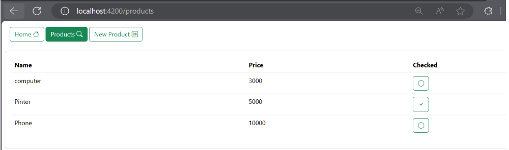
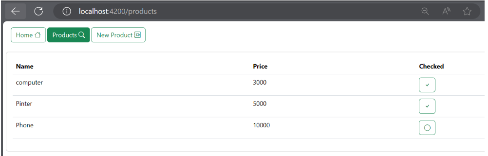

<h3>2. Angular avec une REST API basée sur Json-Server </h3>

    La mise en place d'une REST API pour notre application Angular est facilitée grâce à l'utilisation de JSON Server.

<h4>2.1 Installation de JSON Server</h4>

    Tout d'abord, nous devons nous assurer d'avoir JSON Server installé globalement en exécutant la commande suivante dans le terminal :

<pre>
    <code>npm install -g json-server</code>
</pre>

<h4>2.2 Création du fichier de données (db.json)</h4>

    Ensuite, nous créons un fichier de données nommé <strong>db.json</strong> contenant les informations sur nos produits ou d'autres données nécessaires.
    Nous plaçons ce fichier dans un dossier appelé <strong>data</strong>.

<pre>
// db.json
{
    "products": [
        // ... données des produits
    ],
    "users": [
        // ... données des utilisateurs
    ]
}</pre>
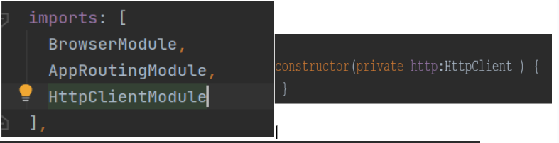

<h4>2.3 Lancement de JSON Server</h4>

    Utilisons la commande suivante pour lancer JSON Server en spécifiant le chemin vers notre fichier <strong>db.json</strong> et le port (8089) :

<pre>
    <code>json-server -w data/db.json -p 8089</code>
</pre>

    L'option -w est utilisée pour activer le mode de surveillance des fichiers, ce qui est utile lorsque nous souhaitons que JSON Server mette à jour automatiquement les données en fonction des modifications apportées au fichier db.json.

    Cela démarrera notre serveur API REST sur le port 8089. Nous pouvons personnaliser le port selon nos besoins.

<h4>2.4 Envoi de requêtes HTTP vers le Backend</h4>

    Nous pouvons maintenant envoyer des requêtes HTTP à notre backend pour récupérer des données. N'oublions pas d'importer le module correspondant
    dans le fichier <strong>app.module.ts</strong> de notre application Angular.

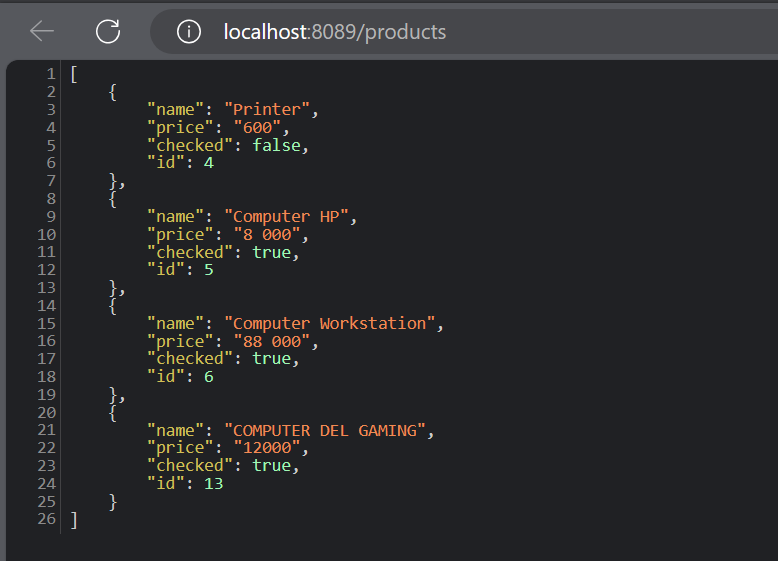

<h2>Captures d'Écran des Pages avec Gestion des Droits d'Accès</h2>
<h3>Génération des tokens</h3>
<h4>Admin</h4>
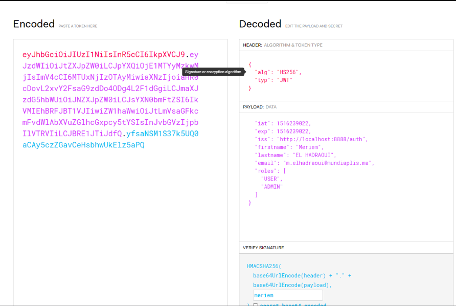
<h4>User normal</h4>
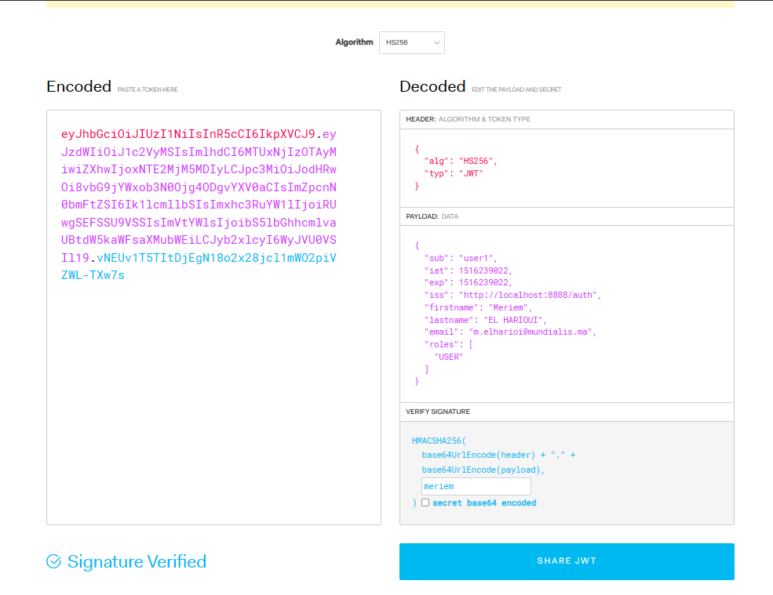

Ensuite, l'installation du Base64 helper.

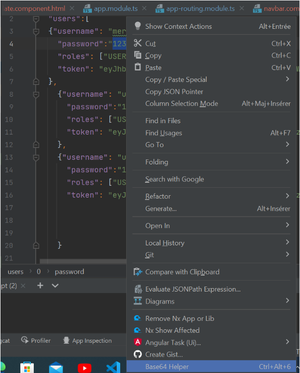

 Puis, l'utilisation du base64 helper pour encoder les mots de passe.

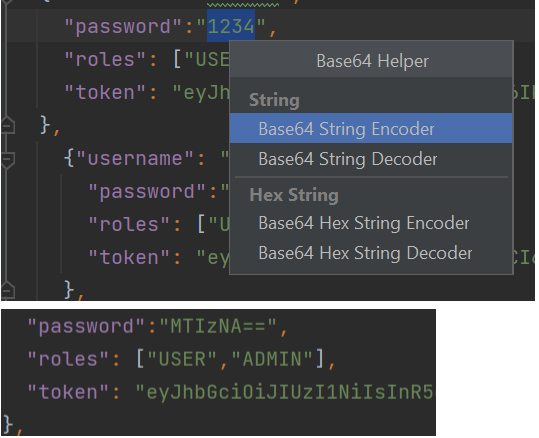

Enfin, on peut visualiser les données des utilisateurs

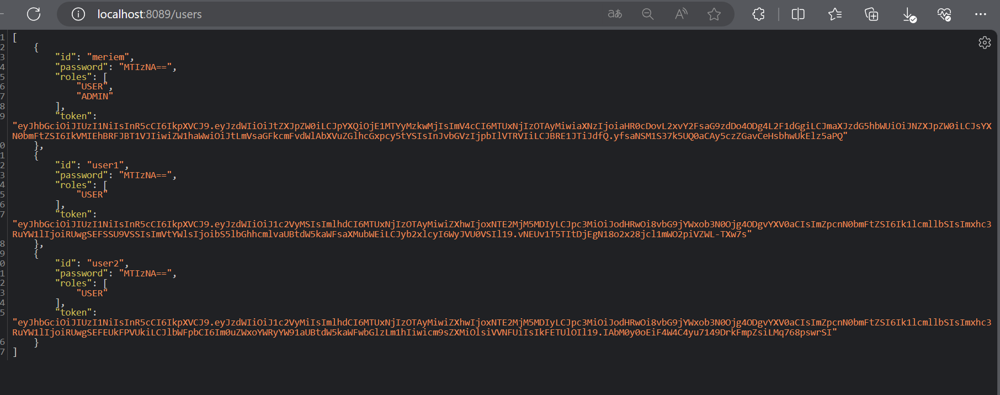

<h2>Pages Accessibles aux Utilisateurs</h2>
<h4>Afficher la page d'authentification</h4>
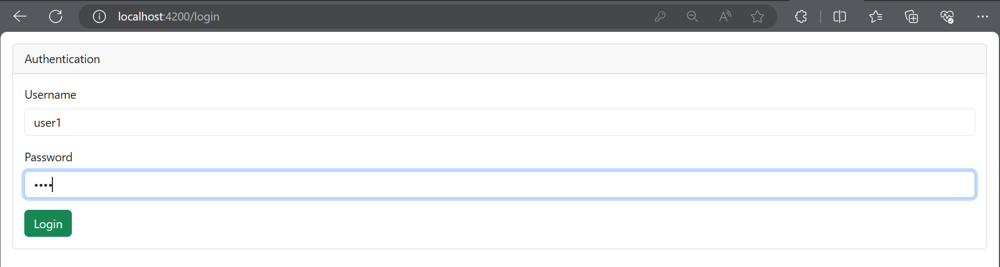
<h4>Afficher la page d'accueil</h4>
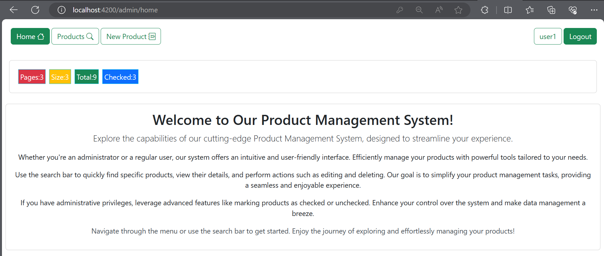
<h4>Afficher les Produits</h4>
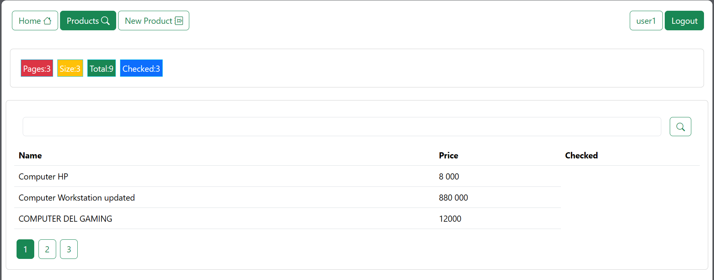
<h4>Rechercher les Produits</h4>
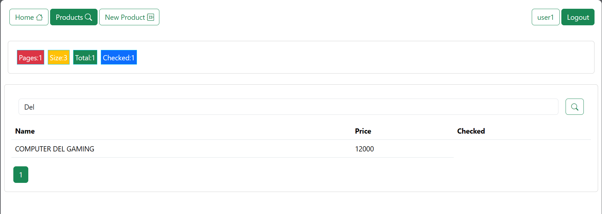
<h4>Ajouter un Produit</h4>
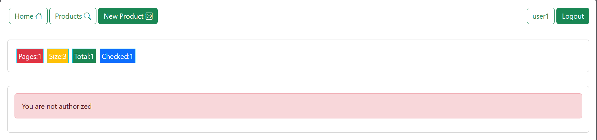

<h2>Pages Accessibles aux Administrateurs</h2>
<h4>Afficher la page d'authentification</h4>
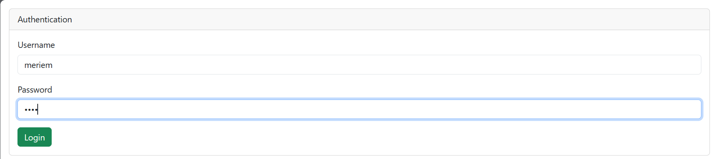
<h4>Afficher la page d'accueil</h4>
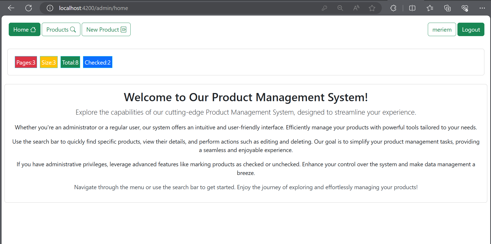
<h4>Afficher les Produits</h4>
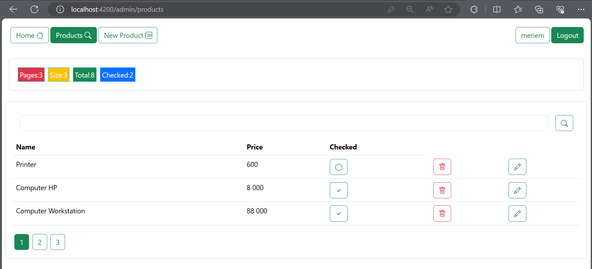
<h4>Rechercher les Produits</h4>
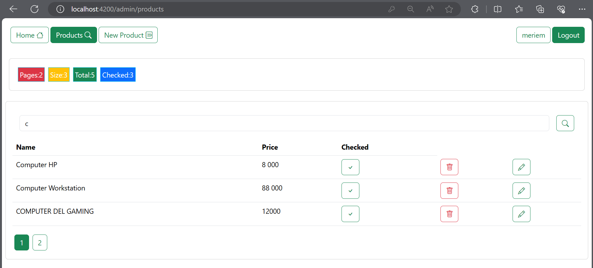
<h4>Valider un Produit</h4>
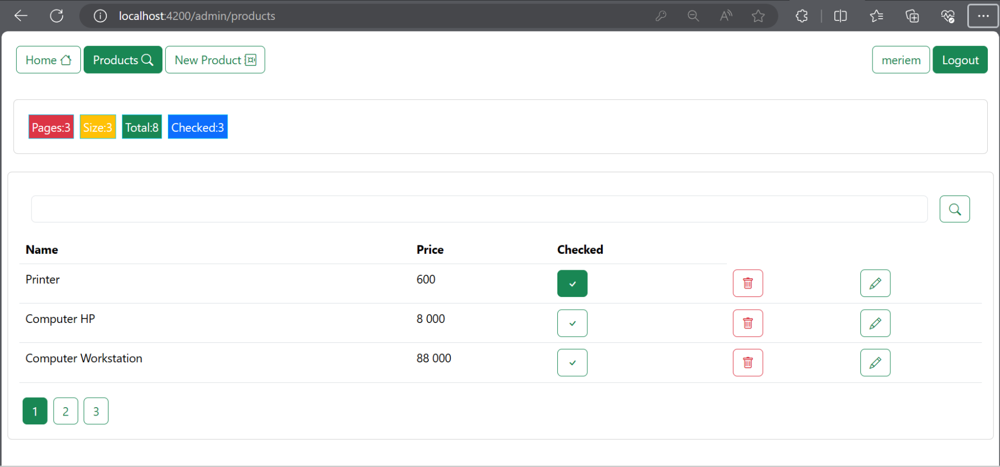
<h4>Ajouter un Produit</h4>
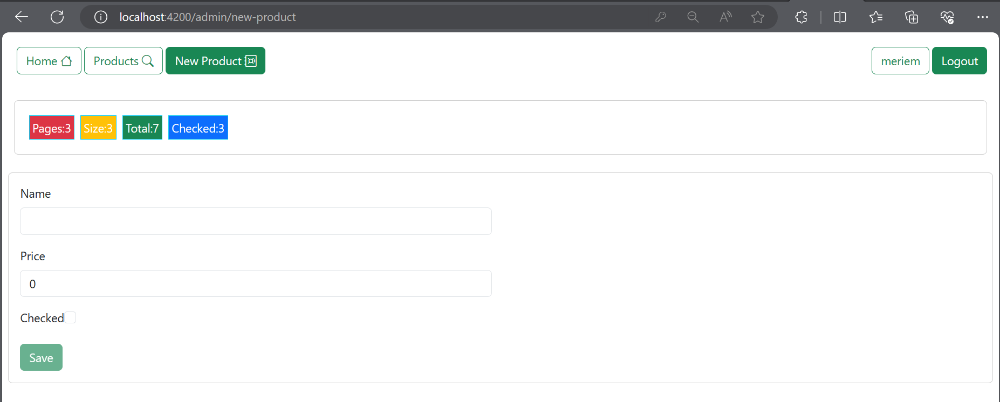
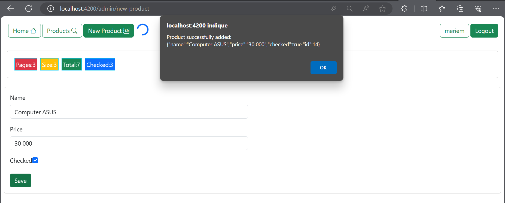
<h4>Modifier un Produit</h4>
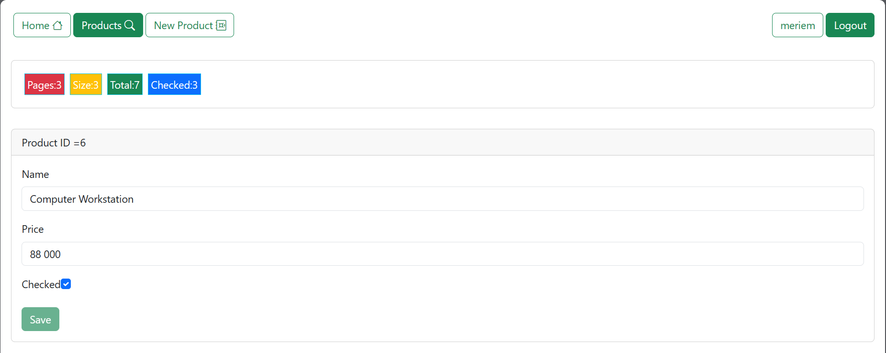
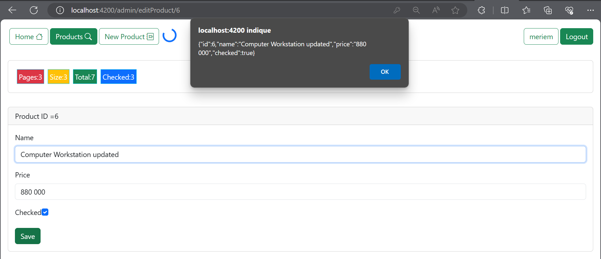
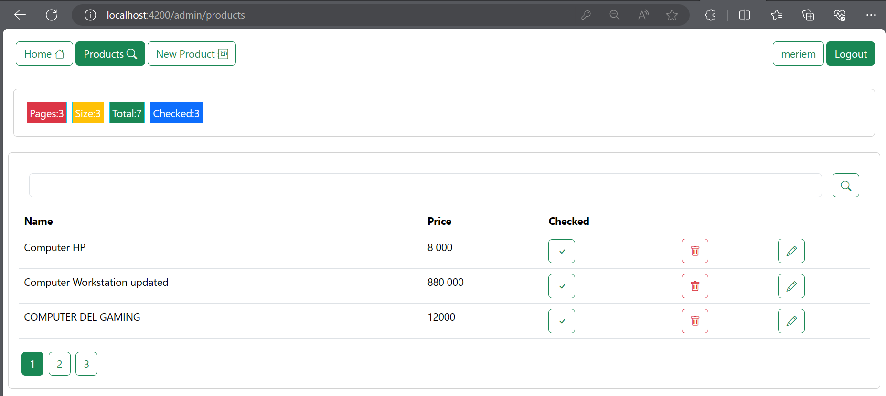
<h4>Supprimer un Produit</h4>
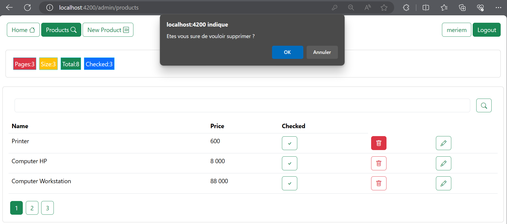

<h2>Conclusion</h2>

  Cette application Angular offre une expérience utilisateur conviviale pour la gestion des produits. Elle implémente des fonctionnalités essentielles telles que l'affichage des produits, la recherche, la pagination, la suppression, l'édition, la mise à jour, l'authentification avec protection des routes, ainsi que la gestion des droits d'accès différenciés entre les utilisateurs ordinaires et les administrateurs. L'architecture modulaire et les services bien définis permettent une maintenance facile et une évolutivité de l'application.

</body>

</html>
